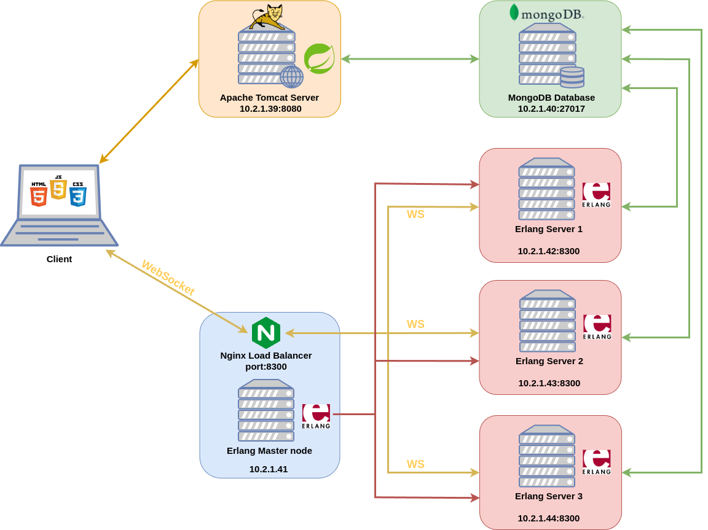

# roiceWebApp - Distributed Web Application
## Architecture

The application has been designed as a distributed system and has been deployed as shown in the following architecture diagram:


## Main Components

- **Apache Tomcat Server (Spring Boot)**
- **MongoDB Database**
- **Nginx Load Balancer**
- **Erlang Master Node**
- **Erlang Server Nodes**

## Deployment Options

You can either run the application on a single machine or in a distributed setting as depicted in the architecture diagram. To use it in a distributed way, the installation of Nginx is required.

### Nginx Installation and Configuration

To install Nginx, follow the [Nginx installation guide](https://docs.nginx.com/nginx/admin-guide/installing-nginx/installing-nginx-open-source/).

The Nginx configuration used is the following one:

```nginx
worker_processes 1;
worker_rlimit_nofile 10000;

events {
    worker_connections 1024;
    # multi_accept on;
}

http {
    map $http_upgrade $connection_upgrade {
        default upgrade;
        '' close;
    }
    
    upstream websocket {
        ip_hash;
        server 10.2.1.42:8300;
        server 10.2.1.43:8300;
        server 10.2.1.44:8300;
    }
    
    server {
        listen 8300;
        location / {
            proxy_pass http://websocket;
            proxy_http_version 1.1;
            proxy_set_header Upgrade $http_upgrade;
            proxy_set_header Connection $connection_upgrade;
            proxy_set_header Host $host;
        }
    }
}

### Commands to Run the Application

#### Local Execution of Erlang Applications

To execute the Erlang applications locally, use the following commands inside their respective folders:

**Inside the `erws` folder:**
```sh
rebar3 shell --name server@127.0.0.1 --setcookie roice

